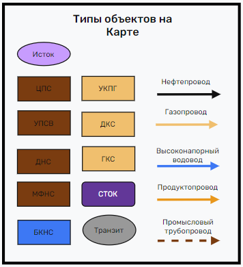
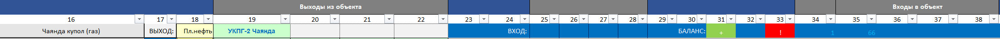

# Общая информация

Ниже описана логика работы графической части, созданной на листе **"Карта"** в Excel. Она основана на стандартном функционале Excel для добавления фигур и соединительных линий. Скрипт отвечает за построение визуальной схемы объектов (исток, объекты, трубы, стоки) и их автоматическое соединение, а также за назначение цветов и макросов для обработки событий (например, двойной клик по объекту).

## Создание фигур (CreateShape)

Основная логика создания фигур описана в процедуре `CreateShape`. Она принимает ряд параметров, указывающих, какую фигуру нужно создать и куда её разместить:

- **modelType** – модель объекта (Исток, Труба, Объект, Сток).  
- **objectName** – название объекта.  
- **GroupType** – тип объекта (Исток, НП, ГП, НПС, БКНС и т. д.).  
- **i** – номер строки объекта на листе **"МТБ"**.  
- **cellLeft**, **cellTop** – координаты по оси X и Y, где будет вставлена фигура.  
- **endCellLeft**, **endCellTop** – координаты окончания трубы (соединительной линии), если это Труба.

Ниже приведён код процедуры:
```basic
Sub CreateShape(ByVal modelType As String, ByVal objectName As String, GroupType As String,_
                ByVal i As Integer, Optional cellLeft As Double = 100, Optional cellTop As Double = 100,_
                Optional endCellLeft As Double = 150, Optional endCellTop As Double = 150)
    ' Создаем необходимую фигуру в соотвествии с объектом(исток - овал, объект - прямоугольник, труба - линия, сток - треугольник)
    Dim ws As Worksheet
    Dim isLine As Boolean
    
    Dim shapeGroup As shape
    Dim shape As shape
    Dim shapeText As shape
    Dim shapeLine As shape
    Dim startShape As shape
    Dim endShape As shape
    
    Dim x1 As Integer, x2 As Integer, y1 As Integer, y2 As Integer
    Dim midX As Integer, midY As Integer
    Dim isTransit As String
    
    isTransit = ""

    Dim targetCell As Range
    Sheets("Карта").Activate
    Set ws = ActiveSheet
    Set targetCell = ws.Range("M3") ' Ячейка рядом с которой будет создан объект
    ' Выбор типа фигуры
    isLine = False
    macroName = "ShowUserForm"
```
### Проверка существующей фигуры
Перед созданием новой фигуры проверяется, есть ли уже фигура с таким именем (заданным номером строки i) на листе "Карта". Если такая фигура существует, создание прерывается:

```basic

    For Each shp In ws.Shapes
        If shp.name = CStr(i) Then
            MsgBox "Фигура уже на доске установлена" & objectName
            shapeExists = True
            Exit Sub
        End If
    Next shp
```
### Определение типа создаваемой фигуры
В зависимости от modelType определяется, какой тип фигуры нужно нарисовать. Ниже приведён пример соответствия типа модели и фигуры:

    - Исток – овал
    - Объект – прямоугольник (или овал, если транзит)
    - Труба – соединительная линия
    - Сток – прямоугольник со скруглёнными углами (вместо треугольника в примере)
На рисунке ниже представлены примеры типов фигур:




```basic
    Select Case modelType
        Case "Исток"
            ' Создание овала
            Set shape = ws.Shapes.AddShape(msoShapeOval, cellLeft, cellTop, 100, 50)
            shape.TextFrame.Characters.Text = objectName
            
        Case "Объект"
            
            isTransit = Sheets("МТБ").Cells(i + 2, 15).value
            ' Создание прямоугольника
            If isTransit = "Транзит" Then
                ' Set shape = ws.Shapes.AddShape(msoShapeRectangle, cellLeft, cellTop, 100, 50)
                Set shape = ws.Shapes.AddShape(msoShapeOval, cellLeft, cellTop, 80, 45)
            Else
                Set shape = ws.Shapes.AddShape(msoShapeRectangle, cellLeft, cellTop, 100, 50)
            End If
            
            shape.TextFrame.Characters.Text = objectName
        Case "Труба"
            ' Создание линии
            ' Set shapeLine = ws.Shapes.AddLine(cellLeft, cellTop, endCellLeft, endCellTop)
            Set shapeLine = ws.Shapes.AddConnector(msoConnectorElbow, cellLeft, cellTop, endCellLeft, endCellTop)
            shapeLine.line.EndArrowheadStyle = msoArrowheadTriangle ' делаем линию - стрелкой
            shapeLine.name = i
            ColorShapeByGroupName GroupType, shapeLine
            ' Привязка макроса к линии
            shapeLine.OnAction = macroName
            shapeLine.line.Weight = 2
            ' Проверяем есть рядом с созданной линией объекты(фигуры) и соединияем если есть
            CheckAndConnectNearestShapes ws, shapeLine, cellLeft, cellTop, endCellLeft, endCellTop
            
            x1 = shapeLine.Left
            y1 = shapeLine.Top
            x2 = x1 + shapeLine.Width
            y2 = y1 + shapeLine.Height
            
            midX = (x1 + x2) / 2
            midY = (y1 + y2) / 2
            
            shapeLine.OnAction = macroName

        Case "Сток"
            ' Создание треугольника
            Set shape = ws.Shapes.AddShape(msoShapeRoundedRectangle, cellLeft, cellTop, 100, 50)
            shape.TextFrame.Characters.Text = objectName
        Case Else
            MsgBox "Неизвестный тип модели: " & modelType, vbExclamation
            Exit Sub
    End Select
```
### Дополнительные настройки и назначение макросов
Для вновь созданной фигуры задаются:
    -  Имя фигуры (shape.Name) – номер строки из листа "МТБ".
    - Макрос при двойном щелчке (shape.OnAction).
    - Заливка и контур (ColorShapeByGroupName).
    - Дополнительный текст или атрибуты (например, AlternativeText).
```basic
    ' Установка названия для фигуры
    If Not shape Is Nothing And isLine = False Then
        If isTransit = "Транзит" Then
            shape.Fill.ForeColor.RGB = RGB(128, 128, 128) ' Средний серый
        Else
            ColorShapeByGroupName GroupType, shape
        End If
        
        shape.name = i
        shape.OnAction = macroName
        shape.AlternativeText = objectName & "&" & modelType & "&" & GroupType
    End If
End Sub
```

### Автоматическое соединение фигур (CheckAndConnectNearestShapes)
Для удобства автоматического соединения труб с ближайшими фигурами используется процедура CheckAndConnectNearestShapes. Она размещена в модуле CreateShapeModule.

```basic
Sub CheckAndConnectNearestShapes(ws As Worksheet, lineShape As shape, cellLeft As Double, cellTop As Double, endCellLeft As Double, endCellTop As Double)
    Dim startCell As Range
    Dim endCell As Range
    Dim startShape As shape
    Dim endShape As shape

    ' Шаг 2: Проверяем, есть ли рядом фигура с началом линии
    Set startShape = FindNearestShape(ws, cellLeft, cellTop)

    ' Шаг 3: Проверяем, есть ли рядом фигура с концом линии
    Set endShape = FindNearestShape(ws, endCellLeft, endCellTop)
    
    ' Шаг 5: Если нашли фигуры рядом, привязываем линию к ним
    If Not startShape Is Nothing Then
        ConnectLineToShape lineShape, startShape, True ' Привязываем начало линии
    End If

    If Not endShape Is Nothing Then
        ConnectLineToShape lineShape, endShape, False ' Привязываем конец линии
    End If

End Sub
```
### Поиск ближайшей фигуры (FindNearestShape)
Функция FindNearestShape ищет фигуру в пределах радиуса minDistance (по умолчанию 150 пунктов), которая поддерживает точки подключения (фигура не должна быть линией или свободной формой).
```basic
' Функция, которая ищет ближайшую фигуру к указанной позиции, поддерживающую соединители
Function FindNearestShape(ws As Worksheet, cellLeft As Double, cellTop As Double) As shape
    Dim shp As shape
    Dim minDistance As Double
    Dim closestShape As shape
    Dim distance As Double

    minDistance = 150 ' Максимальное расстояние до фигуры (можно настроить)

    For Each shp In ws.Shapes
        ' Проверяем, что фигура поддерживает точки подключения
        If shp.AutoShapeType <> msoShapeLine And shp.AutoShapeType <> msoShapeFreeform And shp.Type <> msoLine Then
            If shp.ConnectionSiteCount > 0 Then
                ' Вычисляем расстояние до фигуры
                distance = CalculateDistance(cellLeft, cellTop, shp.Left + shp.Width / 2, shp.Top + shp.Height / 2)
                If distance < minDistance Then
                    Set closestShape = shp
                    minDistance = distance
                End If
            End If
        End If
    Next shp

    Set FindNearestShape = closestShape
End Function


' Функция для расчета расстояния между двумя точками
Function CalculateDistance(x1 As Double, y1 As Double, x2 As Double, y2 As Double) As Double
    CalculateDistance = Sqr((x2 - x1) ^ 2 + (y2 - y1) ^ 2)
End Function

' Функция для привязки линии к фигуре
Sub ConnectLineToShape(line As shape, shape As shape, isStart As Boolean)
    If isStart Then
        ' Привязываем начало линии к фигуре
        line.ConnectorFormat.BeginConnect shape, 3
    Else
        ' Привязываем конец линии к фигуре
        line.ConnectorFormat.EndConnect shape, 1
    End If
End Sub
```


### Раскрашивание фигур (ColorShapeByGroupName)
    Процедура ColorShapeByGroupName, расположенная в модуле Colorizer, задаёт цвет заливки и контура фигур в зависимости от их типа. Для некоторых типов (например, линии) цвет применяется только к контуру, а для других — и к заливке, и к контуру.

```basic

Public Sub ColorShapeByGroupName(groupName As String, shp As shape)
    ' Цветовое распределение объектов
    Dim colorValue As Long
    
    Select Case groupName
        Case "Исток"
            colorValue = RGB(204, 153, 255) ' Светло-сиреневый
        Case "Сток"
            colorValue = RGB(102, 51, 153) ' Темно-сиреневый
        Case "НП", "НПС", "ПСП"
            colorValue = vbBlack  ' Черный
        Case "ЦПС", "УПСВ", "ДНС", "МФНС", "ПТ"
            colorValue = RGB(131, 60, 11)  ' Коричневый
        Case "БКНС", "ВД"
            colorValue = RGB(68, 114, 196)  ' Синий
        Case "ГП", "УКПГ", "ДКС", "ГКС"
            colorValue = RGB(255, 192, 0)  ' Темно-желтый
        Case "ПП"
            colorValue = RGB(237, 125, 49)  ' Оранжевый
        Case "Транзит"
            colorValue = RGB(128, 128, 128) ' Средний серый
        Case Else
            ' Если тип не распознан, устанавливаем цвет по умолчанию (серый)
            colorValue = vbGray
    End Select
    
    ' Применяем цвет к фигуре
    On Error Resume Next
    If groupName = "ГП" Or groupName = "НП" Or groupName = "ПП" Or groupName = "ВД" Or groupName = "ПТ" Then
        ' Если фигура является линией, применяем цвет только к контуру
        shp.line.ForeColor.RGB = colorValue
        shp.line.Weight = 3 ' Толщина линии
    Else
        ' Если фигура не линия, применяем цвет заливки и контура
        shp.Fill.ForeColor.RGB = colorValue
        shp.line.ForeColor.RGB = colorValue
        shp.line.Weight = 5 ' Увеличиваем толщину линии
        
        ' Проверяем, является ли цвет заливки чёрным
        If colorValue = vbBlack Or colorValue = RGB(102, 51, 153) Then
            shp.TextFrame.Characters.Font.Color = vbWhite
        ElseIf colorValue = RGB(204, 153, 255) Or colorValue = RGB(255, 192, 0) Then  ' Темно-желтый
            shp.TextFrame.Characters.Font.Color = vbBlack
        End If
    End If
    On Error GoTo 0
End Sub
```

## Построение Линии Трубопроводов

В данном разделе описывается логика, по которой определяется, что каждая линия (трубопровод) имеет входное и выходное соединения. Эти соединения позволяют алгоритму понимать, куда «притекать» флюиду и откуда «утекать», формируя тем самым схему для дальнейшего расчёта материального баланса.

- **Входное соединение** — это объект (например, какой-то технологический узел), к которому трубопровод «подключён» своим началом.
- **Выходное соединение** — это конечный объект, куда трубопровод «ведёт» свой поток.

Также обрабатываются различные стили линий (сплошная, штриховая, точечная), которые в дальнейшем позволяют алгоритму понимать назначение трубопровода и корректно добавлять их в таблицу для расчётов.

### Основная процедура: ProcessShapesLineType


```basic
Public Sub ProcessShapesLineType(Optional startYear As Integer = 0, Optional endYear As Integer = 0, Optional pauseSec As Integer = 3)
    Dim shp As shape
    Dim conn As shape
    Dim endshp As shape
    Dim currentShape As shape
    Dim ungroupedShapes As ShapeRange
    Dim reGroupedShapes As shape
    Dim groupAltText As String
    
    Dim processedShapes As New Collection
    Dim shapeQueue As New Collection
    
    Dim lineType As String
    Dim lineName As String
    Dim lineRowInt As Long
    
    Dim beginConnectionRow As String
    Dim endConnetionRow As String
    
    Dim beginShapeAltText As Variant
    Dim endShapeAltText As Variant
    Dim lineAltText As Variant
    
    Dim shapeWithLine As ShapeWithLineClass
    
    Set objectsCollection = New Collection
    Set currentShape = FindLeftmostShape()
    
    Call setPublicYearData
    
    Call Otkl_Ekran_Max
```
Перед записью новых данных о входных и выходных трубопроводов(объектов) вызывается структура которая очищает информацию по входным и выходным объектам(трубам) в листе "МТБ" - мы храним информацию о том какие выходные и входные трубопроводы есть у конкретного объекта в Листе "МТБ" в столбцах:
    - входные трубопроводы(объекты) - столбцы с 19 по 22
    - выходные трубопроводы(объекты) - столбцы с 35 по 38
на рисунке изрображена строка из Листа "МТБ" в которой показана что из **"Чаянда купол(газ)"** выходит только один трубопровод который ведет в **"УКПГ-2 Чаянда"**, а входит в него объект под номером **"66"**


Функция ClearOutputObjs очищает данные ячейки, чтобы вставить новую информацию.
```basic
    Call ClearOutputObjs ' Очистим все выходные и входные соединения с объектами
```

```basic

Sub ClearOutputObjs()
    Dim conn As shape
    Dim shp As shape
    Dim shapeWithLine As ShapeWithLineClass
    Dim ungroupedShapes As ShapeRange
    Dim reGroupedShapes As shape
    Dim originalGroupName As String
    Dim originalGroupAltText As String
    
    ' Итерация по всем фигурам на листе
    For Each conn In ActiveSheet.Shapes
        Set shapeWithLine = New ShapeWithLineClass
        Set shapeWithLine.lineShape = conn

        If conn.connector Then
            ' Обработка одиночного соединительного объекта
            If conn.ConnectorFormat.BeginConnected And conn.ConnectorFormat.EndConnected Then
                LoadObjsConnections conn, shapeWithLine
                ClearObjOutputInTablePromisloviiPipe shapeWithLine
            End If
        End If
    Next conn
End Sub
' Обработка соединительного объекта
Sub LoadObjsConnections(connector As shape, ByRef shapeWithLine As ShapeWithLineClass)
    If connector.ConnectorFormat.BeginConnected Then
        ' Получаем начальные и конечные объекты
        Dim beginShape As shape
        Dim endShape As shape
        
        Set beginShape = connector.ConnectorFormat.BeginConnectedShape
        Set endShape = connector.ConnectorFormat.EndConnectedShape
        
        ' Устанавливаем строки начального и конечного объекта
        shapeWithLine.beginConnectionRow = ExtractRowFromName(beginShape.name)
        shapeWithLine.endConnetionRow = ExtractRowFromName(endShape.name)
        
        
        ' Добавляем данные о соединении в таблицу
        shapeWithLine.beginConnectionObjName = beginShape.name
        shapeWithLine.endConnectionObjName = endShape.name
    End If
End Sub
' Удаление старых выходных потоков из Листа МТБ при соединении промысловых трубопроводов
Sub ClearObjOutputInTablePromisloviiPipe(shapeWithLine As ShapeWithLineClass)
    
    ' Устанавливаем строки начального и конечного объекта
    Sheets("МТБ").Range(Sheets("МТБ").Cells(shapeWithLine.beginConnectionRow, 19), Sheets("МТБ").Cells(shapeWithLine.beginConnectionRow, 22)).ClearContents
    Sheets("МТБ").Range(Sheets("МТБ").Cells(shapeWithLine.beginConnectionRow, 35), Sheets("МТБ").Cells(shapeWithLine.beginConnectionRow, 38)).ClearContents

    Sheets("МТБ").Range(Sheets("МТБ").Cells(shapeWithLine.endConnetionRow, 19), Sheets("МТБ").Cells(shapeWithLine.endConnetionRow, 22)).ClearContents
    Sheets("МТБ").Range(Sheets("МТБ").Cells(shapeWithLine.endConnetionRow, 35), Sheets("МТБ").Cells(shapeWithLine.endConnetionRow, 38)).ClearContents

End Sub
```

Продолжаем структуру после выполнения ClearOutputObjs

Код обходит все фигуры(**ActiveSheet.Shapes**) на листе "Карта" (включая группы), и  определяет, какие из shapes являются линиями (трубопроводами) **conn.connector**, и собирает необходимую информацию о подключениях. Записывается информацию в Лист МТБ по каждому объекту, трубопроводу, к какому объекту какие у него есть входные и выходные трубопроводы и объекты 
```basic
    Vremya_Pusk = Time 'включаем секундомер
    Sheets("МТБ").Range("Старт") = Vremya_Pusk
    
    For Each conn In ActiveSheet.Shapes
        Set shapeWithLine = New ShapeWithLineClass
    
        lineType = "None"
        lineName = ""
        
        Set shapeWithLine.lineShape = conn
        shapeWithLine.lineType = lineType
        shapeWithLine.lineName = lineName
```
**ShapeWithLineClass** - это класс модуль для хранения данных (dataclass)

```basic
        Set currentShape = shapeWithLine.lineShape

        ' Тут был If conn.Type = msoGroup Then уже не используется
        If conn.connector Then
            ' Это для трубопроводов
            If conn.ConnectorFormat.BeginConnected And conn.ConnectorFormat.EndConnected Then
                lineName = conn.name
                Set endshp = conn.ConnectorFormat.EndConnectedShape
                endShapeAltText = ParseAlternativeText(endshp.AlternativeText)
                
                Set currentShape = conn.ConnectorFormat.BeginConnectedShape
                beginShapeAltText = ParseAlternativeText(currentShape.AlternativeText)
                
```

При создании геометрических фигур(объектов, не трубопроводов) мы задали в атрибуте фигуры(Shape).AlternativeText данные об объекте это **"Название объекта"&"Модель Объекта"&"Тип Объекта"**
    - пример: shape.AlternativeText = **НПС 12&Объект&НПС**
этот текст парсится на и присваиваются данные для объетов

```basic
                
                beginConnectionRow = currentShape.name
                
                If IsNumeric(lineName) Then
                    lineRowInt = CLng(lineName)
                Else
                    lineRowInt = CLng(-1) ' Значение по умолчанию
                End If
                
                endConnetionRow = endshp.name
                Set shapeWithLine = New ShapeWithLineClass
                Set shapeWithLine.endConnetionShape = conn.ConnectorFormat.EndConnectedShape
                Set shapeWithLine.lineShape = conn
                
                
                shapeWithLine.beginConnectionRow = CLng(beginConnectionRow)
                shapeWithLine.beginConnectionObjName = beginShapeAltText(0)
                shapeWithLine.beginConnectionObjModel = beginShapeAltText(1)
                shapeWithLine.beginConnectionObjGroup = beginShapeAltText(2)
                Set shapeWithLine.beginConnetionShape = currentShape
                            
                shapeWithLine.lineType = lineType
                shapeWithLine.lineName = lineName
                
                shapeWithLine.endConnetionRow = CLng(endConnetionRow)
                shapeWithLine.endConnectionObjName = endShapeAltText(0)
                shapeWithLine.endConnectionObjModel = endShapeAltText(1)
                shapeWithLine.endConnectionObjGroup = endShapeAltText(2)
                Set shapeWithLine.endConnetionShape = endshp
                shapeWithLine.lineRow = lineRowInt
```
Эта часть кода нам нужна чтобы использовать разную логику записи информации об объектах, **msoLineDash(перерывистая линия)** если соединительная труба является **промысловой**(про промысловые объекты прочитет тут -----)? для остальных трубопроводов используется **msoLineSolid(сплошная линия)** и вызывается структура **AddFlowsToTableAndInitObjects**

```basic
                Select Case conn.line.DashStyle
                    
                    Case msoLineSolid
                        lineType = "Solid"
                        AddFlowsToTableAndInitObjects shapeWithLine
                    Case msoLineDash
                        shapeWithLine.lineName = "Промысловая труба"
                        AddDashLineDataToTable shapeWithLine
                    Case msoLineDot
                        lineType = "Dot"
                    Case msoLineLongDashDot
                        lineType = "LongDashDot"
                    Case Else
                        lineType = "Other"
                End Select
                    
            End If
        
        End If
    Next conn
    Call CalculateMaterialBalance(startYear, endYear, pauseSec)
End Sub
```