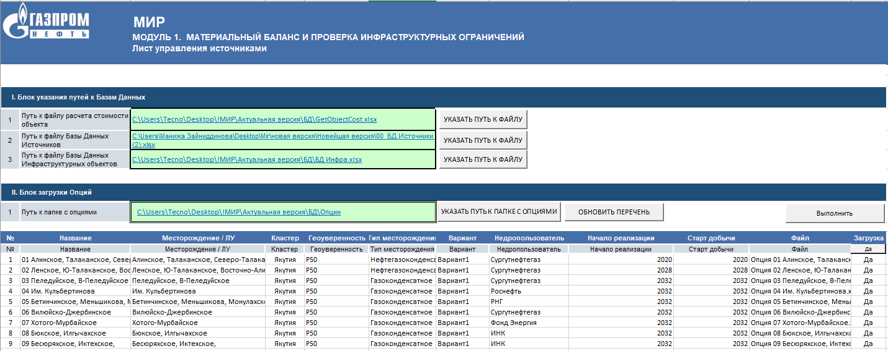

## Подготовка исходных данных для расчета

Подготовка исходных данных для расчета в системе МИР является одним изважных этапов формирования модели для расчета. Исходные данные для расчета подготавливаются на листе "Титул".

Перед началом расчета следует убедиться что все поля на листе "Титул" заполнены.

Ссылочный файл **расчет стоимости объекта** содержит в себе таблицу удельных расценок CAPEX, на основании которого производится итоговый расчет стоимости объекта.

Файл **база данных источников** содержит в себе информацию о профилях добычи нефти, газа, конденсата, воды на месторождении.

Файл **база данных инфраструктурных объектов** содержит в себе информацию о типе объекта, установленной мощности, и типе флюида (жидкость или газ) с которым работает инфраструктурный объект.

Папка с базой данных опций содержит файлы с вариантами прифилей для источников. Фактически это механиз реализации различных сценариев добычи для источников. Данные по профилям из файлов в папке "Опции" далее подставляются в профиль добычи источников.

Кнопка "ОБНОВИТЬ ПЕРЕЧЕНЬ" осуществляет оновление списка опций.

Кнопка "Выполнить" осуществляеть импорт профилей из файлов опций в файлы Базы Данных Источников.
