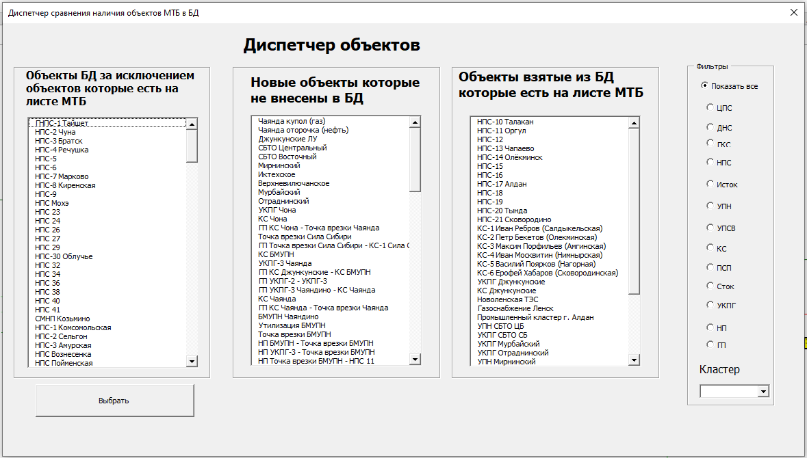
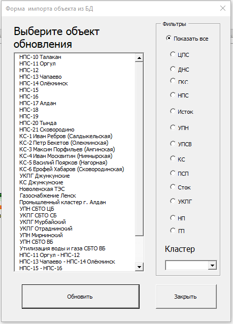
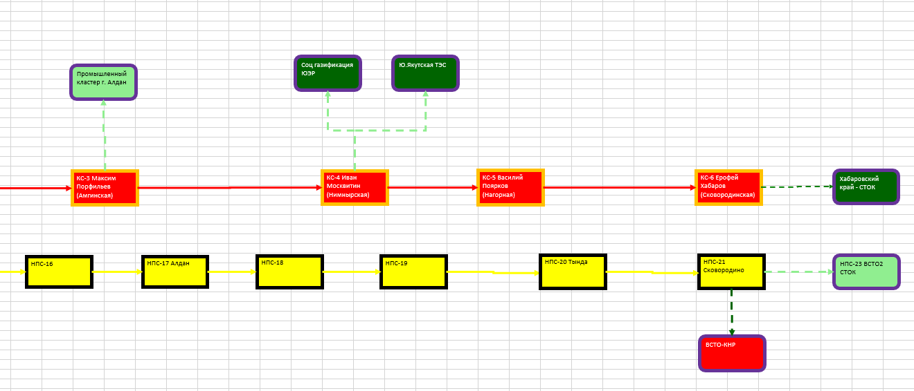
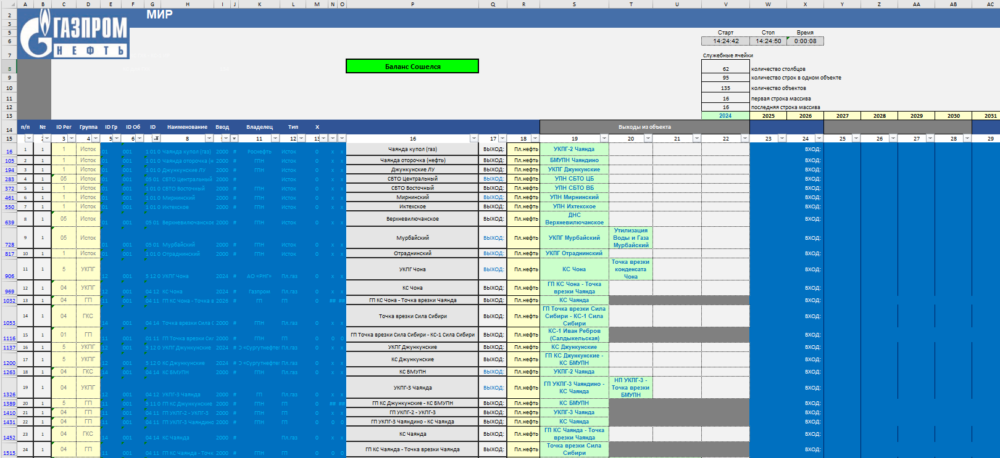
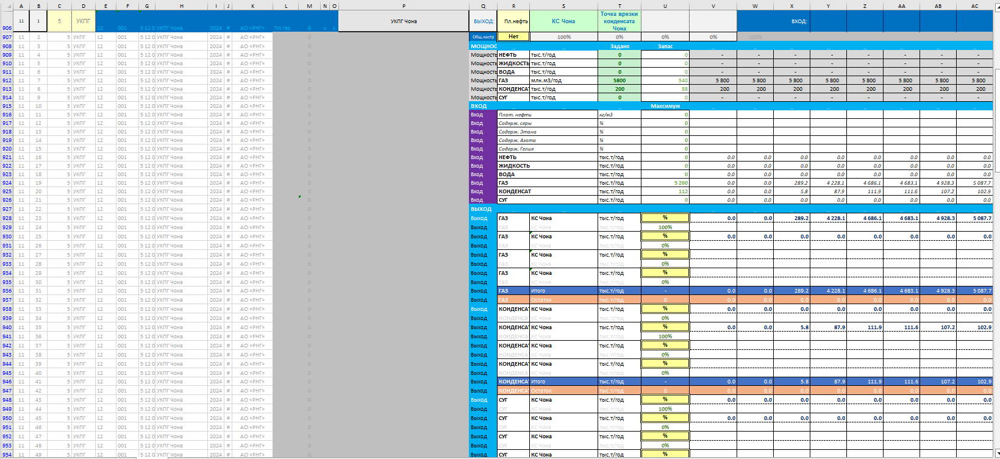

## Перечень листов Excel

| Название листа                                | Описание содержимого листа                                                                                                                                                                                                                                                                                                                                                                   |
| ---------------------------------------------------------- | -------------------------------------------------------------------------------------------------------------------------------------------------------------------------------------------------------------------------------------------------------------------------------------------------------------------------------------------------------------------------------------------------------------------- |
| Титул                                                 | Лист содержит пути к базам данных проекта, настройки опций, инструменты обновления данных.                                                                                                                                                                                                                                               |
| МТБ                                                     | Лист представляет собой базу данных объектов с их настройками, для которых производится расчет материального баланса.                                                                                                                                                                                           |
| Карта                                                 | Лист содержит графическое представление объектов, УПН, УКПГ, месторождений и т.д., трубопроводную систему, а также панель управления с которой производится моделирование, расчет, обновление параметров расчетной системы. |
| ГрафикРаспредОдинОбъект             | Лист содержит диаграмму распределения по источникам объектов по годам.                                                                                                                                                                                                                                                                                  |
| ГрафикЗагрузкиЦепочкиОбъектов | Лист содержит диаграмму нагрузки выбранных объектов по годам.                                                                                                                                                                                                                                                                                                   |
| Источ                                                 | Лист содержит информацию по Источникам (месторождениям).                                                                                                                                                                                                                                                                                                             |
| инф. Ошибка Баланса                        | Сервисный лист содержит ошибки расчета МТБ, название объекта, группу объекта, категорию объекта, тип флюида и информацию об ошибке.                                                                                                                                                                     |
| инф. Изменения объектов                | Лист содержит информацию о сверке данных текущих объектов с данными объектов из БД.                                                                                                                                                                                                                                                            |
| Инструкция                                       | Лист содержит инструкцию для пользователя для управления расчетом и созданию объектов.                                                                                                                                                                                                                                                    |
| Справочник                                       | Сервисный лист, содержит маркировку объектов, шифры регионов, типы флюидов.                                                                                                                                                                                                                                                                           |
| Ш_Ист                                                  | Лист является шаблоном для источника, формой которая далее хранится в базе данных расчета на листе МТБ.                                                                                                                                                                                                                        |
| Ш_НВГКС                                              | Лист является шаблоном для объектов, которые работают с флюидами (Нефть, Вода, Газ, Конденсат, СУГ), формой которая далее хранится в базе данных расчета на листе МТБ.                                                                                                          |
| Ш_В                                                      | Лист является шаблоном для объектов, которые работают с водой, формой которая далее хранится в базе данных расчета на листе МТБ.                                                                                                                                                                           |
| Ш_НВК                                                  | Лист является шаблоном для объектов, которые работают с флюидами (Нефть, Вода, Конденсат), формой которая далее хранится в базе данных расчета на листе МТБ.                                                                                                                          |
| Ш_КС                                                    | Лист является шаблоном для объектов, которые работают с флюидами (Конденсат, СУГ), формой которая далее хранится в базе данных расчета на листе МТБ.                                                                                                                                        |
| Ш_ГКС                                                  | Лист является шаблоном для объектов, которые работают с флюидами (Газ, Конденсат, СУГ), формой которая далее хранится в базе данных расчета на листе МТБ.                                                                                                                                |
| Ш_ОБ                                                    | Лист является шаблоном для источника, формой которая далее хранится в базе данных расчета на листе МТБ.                                                                                                                                                                                                                        |
| Ш_ТР                                                    | Лист является шаблоном для трубопровода, формой которая далее хранится в базе данных расчета на листе МТБ.                                                                                                                                                                                                                  |
| Ш_Сток                                                | Лист является шаблоном для стока, формой которая далее хранится в базе данных расчета на листе МТБ.                                                                                                                                                                                                                                |
| Список об                                          | Сервисный лист, хранит список объектов используемых в расчете.                                                                                                                                                                                                                                                                                                  |
| Схема                                                 | Сервисный лист для хранения схемы пользователя при создании объекта.                                                                                                                                                                                                                                                                                      |
| СоставПоИстокам                             | Сервисный лист хранит данные о количестве флюида, поступающего от различных месторождений на объект.                                                                                                                                                                                                                           |

## Панель управления

Панель управления один из основных иструментов создания расчета в МИР. Сама панель управления всегда находится над объектами MS Excel и не закрывается при переходе из листа в лист.

На панеле управления расположены следующие кнопки:

**Создать объект** -  создает объект на Листе "Карта", УПНГ, УКПГ, трубопроводыд и др.

**Вставить объект** - вставляет объект из листа "МТБ" если его нет на листе "Карта". Такое может случится если пользователь вырезал графический объект из листа, а на листе "МТБ" он остался, а также может возникнуть ситуация в том случае импорта опций. В этом случае на листе МТБ создадутся объекты, а графического представления не будет, в этом случае истоки можно будет вставить через данный функционал.

**Выделеить все объекты** - выделяет все объекты на листе "Карта".

**Удалить объект** - удаляет выбранный объект как из листа "Карта" так и из листа "МТБ".

**Очистить схему** - удаляет все объекты из листа "Карта".

**РАССЧИТАТЬ**  -  производить расчет материального балланса.

**Показать динамику загрузки** -  перекрашивает объекты на листе "Карта" согласно их нагрузке по годам.

**Отобразить цвета объектов** -  возвращает базовые цвета объектов на листе "Карта".

**Синхронизировать Лист МТБ с Картой** - удаляет объекты из листа "МТБ", если их нету на листе "Карта".

**Обновить профиль источника** - открывает форму со списком источников в которой пользователь выбирает конкретный источник который нужно обновить, обновляется только профиль данного источника обновляется в Листе "Источ"

**Обновить все источники** - обновляет все профили источников которые есть в Базе данных Источников.

**Диспетчер объектов** - отображает окно с информацией об объектах базы данных которых нет на листе "МТБ", и об объектах, которые есть на листе "МТБ" но нет в базе данных.

**Обновить все источники** - обновляет данные объекта из базы данных объектов.

**Обновить все источники** - обновляет все объекты, которые есть в базе данных и на листе "Карта".

## Информационная панель

Информационная панель служит для информирования пользователя о цветовой дифференциации объектов по их нагрузке, а также базовой цветовой дифференциации. Также на панеле приведена информация о флюиде с которым работает объект.

## Представление объектов на листе "Карта"

В МИР реализовано графическое представление объектов на листе "Карта". Это базовые объекты MS Excel соединенные между собой связями. Все объекты имеют наименования. Цвета объектов устанавливаются автоматических согласно цветовой дефференциации.

## Цифровой профиль объектов на листе "МТБ"

Цифровое представление объектов харнится на листе "МТБ". По сути своей это база данных объектов текущего расчета, которую можно обновлять пополнять или наооборот удалять лишние объекты. Все операции на листе МТБ автоматизированы, и без особой необходимости не следует на листе менять данные. Это может привети к не правильной работе программы. По строки содержащие данные об объекте свернуты, двойным кликом на названии объекта можно раскрыть полную информаию об объекте.

